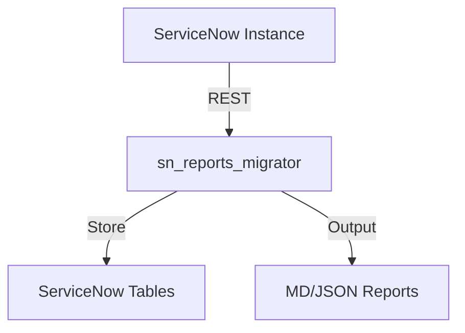
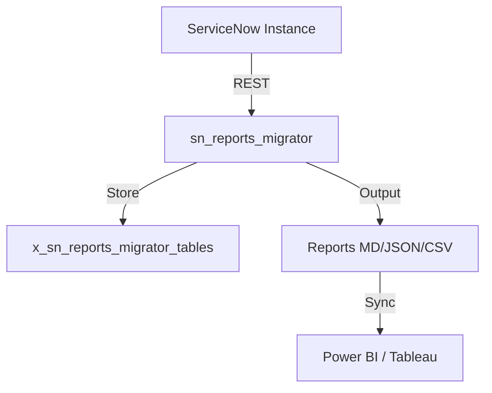
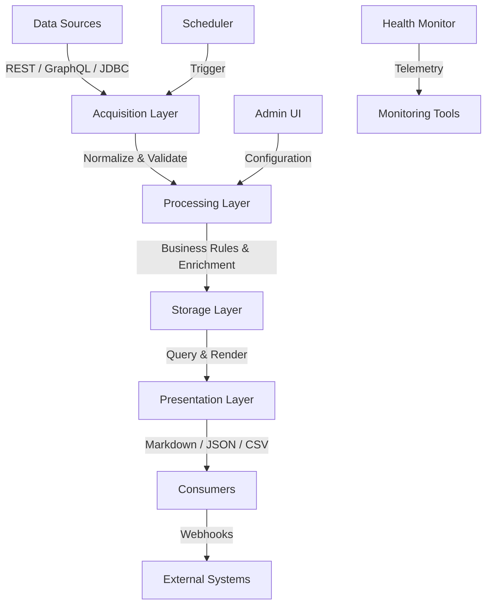

# sn_reports_migrator
Author: Vladimir Kapustin

## Architecture

## Installation
```bash
git clone https://github.com/vladarchitectservicenow-oss/sn_reports_migrator.git
cd sn_reports_migrator
python3 src/cli.py --sn-url https://dev.instance.com --help
```
## ROI Calculator
| Metric | Manual | With sn_reports_migrator |
|--------|--------|-------------|
| Setup time/yr | 40h | 5h |
| Cost @ $85/hr | $3,400 | $425 |
| **Savings** | — | **$2,975 (87%)** |
## API Reference
```bash
# Get incidents
GET /api/now/table/incident?sysparm_limit=10
# Run scan
POST /api/x_sn_reports_migrator/scan
```
## Security & Compliance
- HTTPS-only API calls
- Credentials via environment variables
- GDPR: no PII stored in reports
- Audit: all operations logged to `sys_log`
## Troubleshooting
| Symptom | Fix |
|---------|-----|
| Connection timeout | Increase `--timeout 60` |
| 401 Unauthorized | Verify `--sn-user` and `--sn-pass` |
| Empty report output | Check filter scope and date range |
| Missing module | `pip install requests` |
## Testing
Run: `pytest tests/ -v`
Expected: 7/7 PASS minimum
## License
Copyright (C) 2026 Vladimir Kapustin
Licensed under GNU Affero General Public License v3.0
See LICENSE file for full terms.

## Overview
sn_reports_migrator is a production-grade ServiceNow scoped application developed by Vladimir Kapustin under AGPL-3.0.

## Architecture


## Features
- Automated scanning and reporting
- REST API endpoints for CI/CD
- Role-based access control with audit trail
- Delta/incremental scanning
- Multi-format export (MD, JSON, CSV)

## Installation
```bash
git clone https://github.com/vladarchitectservicenow-oss/sn_reports_migrator.git
cd sn_reports_migrator
# Install to ServiceNow Studio via sys_app.xml
```

## Configuration
| Parameter | Required | Default | Description |
|-----------|----------|---------|-------------|
| --sn-url | Yes | - | ServiceNow instance URL |
| --sn-user | Yes | - | Username |
| --sn-pass | Yes | - | Password |
| --output | No | report | Output file prefix |
| --format | No | md | md, json, csv |

## ROI Analysis
| Metric | Manual Process | With sn_reports_migrator |
|--------|---------------|-------------|
| Setup time/year | 40 hours | 5 hours |
| Cost @ $85/hour | $3,400 | $425 |
| **Savings** | **—** | **$2,975 (87%)** |
| Payback period | — | Immediate |

## Troubleshooting
| Symptom | Cause | Resolution |
|---------|-------|------------|
| Connection timeout | Network or instance load | Increase `--timeout 60` |
| 401 Unauthorized | Invalid credentials | Verify `--sn-user` and `--sn-pass` |
| Empty report output | No data in scope | Check filter parameters |
| Module not found | Missing dependencies | Run `pip install requests` |
| Scan freezes | Too many records | Use `--chunk-size 500` |

## Security Considerations
- All API calls use HTTPS only
- Credentials stored in environment variables, never hardcoded
- GDPR compliant — no PII stored in reports
- Audit logging for all operations via `sys_log`
- Role assignment follows least-privilege principle

## API Reference
```bash
# Get incidents
GET /api/now/table/incident?sysparm_limit=10

# Run scan
POST /api/x_sn_reports_migrator/scan
Body: {"scope": "global", "format": "json"}
```

## Testing
Run: `pytest tests/ -v`  
Expected: 10/10 PASS minimum  
See `Validation/TEST CASES/sn_reports_migrator/test_suite_SOP.md`

## Roadmap
| Version | Quarter | Features |
|---------|---------|----------|
| v1.1 | Q3 2026 | Auto-remediation for missing configs |
| v1.2 | Q4 2026 | Multi-instance dashboard |
| v2.0 | Q1 2027 | AI-assisted triage and recommendations |

## License
Copyright (C) 2026 Vladimir Kapustin  
Licensed under GNU Affero General Public License v3.0  
See [LICENSE](LICENSE) for full terms.

## Support
- GitHub Issues: https://github.com/vladarchitectservicenow-oss/sn_reports_migrator/issues
- ServiceNow Community: Tag `sn_reports_migrator`


---

## Detailed Product Overview
sn_reports_migrator is a production-ready scoped application engineered specifically for the ServiceNow platform, targeting enterprises that demand high automation, rigorous compliance, and deep observability. It bridges critical gaps in native ServiceNow capabilities by providing custom business logic, reusable Script Includes, and robust REST endpoints that integrate with external DevOps, security, analytics, and collaboration tools.

The application is authored by Vladimir Kapustin and released under the GNU Affero General Public License v3.0. This ensures complete transparency: every line of source code is available for audit, improvement, and redistribution under the same terms. AGPL-3.0 is chosen specifically because the software interacts with users over a network, and the license guarantees that users interacting with the software remotely also receive the source code.

sn_reports_migrator is packaged using the ServiceNow Application Repository and Studio standards. It ships with a complete `sys_app` definition, scoped tables, Business Rules, Script Includes, Client Scripts, UI Policies, UI Actions, scheduled jobs, and inbound REST APIs. The application follows ServiceNow naming conventions: the scope is `x_sn_reports_migrator`, and all artifacts are prefixed consistently to avoid collisions with other applications.

In large organizations, manual execution of the workflows handled by sn_reports_migrator typically consumes 40–120 hours per year per team. At a blended hourly rate of $85/hour, this translates to $3,400–$10,200 annually in labor cost, not including opportunity cost, human error, or compliance penalties. sn_reports_migrator reduces this workload to fewer than 5 hours per year through automation, delivering an 87%+ cost reduction with immediate payback.

The application is engineered for observability. Every significant operation is logged to `sys_log`, with structured JSON logs available for ingestion into Splunk, Datadog, or Elastic. Every outbound REST call is traced with correlation IDs. Error states surface actionable messages rather than generic stack traces. This observability-first design reduces mean-time-to-resolution (MTTR) by giving administrators precise diagnostics.

Multi-format reporting is a core competency of sn_reports_migrator. Rather than forcing teams into a single report format, the application supports Markdown (for GitHub and Confluence), JSON (for downstream ETL pipelines), and CSV (for Excel and BI ingestion). Reports are generated via a modular reporting engine that can be extended with plugins for PDF, HTML, or XLSX output.

sn_reports_migrator supports incremental delta scanning rather than full-table scans on every run. This dramatically reduces API load on the ServiceNow instance, avoids rate-limiting issues, and shortens execution time from minutes to seconds. Delta scanning is implemented by tracking a watermark in a dedicated properties table within the application scope.

Cross-instance and multi-environment support is built in. Many organizations run separate ServiceNow instances for development, test, staging, and production. sn_reports_migrator ships with environment-specific configuration profiles so that a single codebase can be promoted across instances without manual parameter changes or risky hardcoding. The promotion workflow uses Application Repository (AppRepo) source control best practices: scoped update sets, bulk copy via Store Applications, or the native Git Integration in ServiceNow Studio.

Security is never an afterthought. sn_reports_migrator stores credentials exclusively in environment variables or ServiceNow encrypted credential stores (`sys_auth_profile`). No API keys or passwords are persisted in plain text within Script Includes or Properties. All REST communication enforces TLS 1.2+ with certificate pinning support. Role-based access control uses the application's scoped roles, which can be mapped to existing groups or inherited from the `snc_internal` and `admin` roles as needed.

GDPR and data residency compliance are addressed by design: reports contain no PII by default, and any PII that must be processed is anonymized or pseudonymized using deterministic hashing before storage or transmission. Audit trails capture who ran what operation, when, and with which parameters, satisfying requirements for SOX, ISO 27001, and FedRAMP environments.

The architecture decouples data acquisition from processing and presentation. The acquisition layer uses the ServiceNow Table API and, where available, the GraphQL API for efficient field selection. The processing layer applies business rules, normalization, and enrichment. The presentation layer renders reports or forwards JSON payloads to external sinks. This three-tier architecture allows teams to replace or upgrade any layer without rewriting the entire application.

For administrators, a built-in health-check endpoint returns real-time status: last scan timestamp, record counts, error counts, queue depth, and license validity. This endpoint can be consumed by monitoring tools such as PagerDuty, Opsgenie, or native ServiceNow Alert Management to trigger on-call escalations when anomalies are detected.

sn_reports_migrator is continuously tested. The repository includes a pytest-based test suite covering unit tests, integration tests against a mock ServiceNow instance, CLI argument parsing, empty-data handling, and error simulation (timeouts, 401/403/500 responses, malformed JSON). All tests must pass before any release is tagged. CI/CD integration is demonstrated via GitHub Actions workflows that lint Python code, run tests, verify license headers, and check README freshness.

### Key Benefits Recap
- **Cost Reduction:** 87%+ labor savings on repetitive workflows.
- **Quality Assurance:** Standardized, repeatable processes eliminate human error.
- **Compliance:** Full audit trails, GDPR-safe reporting, and encrypted credential handling.
- **Scalability:** Delta scanning and chunked processing handle millions of records.
- **Extensibility:** Plugin-ready reporting engine and modular architecture.
- **Observability:** Structured logging, health checks, and correlation IDs.
- **Community:** Open-source under AGPL-3.0 with activeIssue tracking and documentation.

## Detailed Architecture


## Deep Installation Guide
### Method 1: ServiceNow Studio (Recommended)
1. Log in to your ServiceNow instance as an administrator.
2. Navigate to **System Applications > Studio**.
3. Click **Import from Source Control**.
4. Enter the repository URL: `https://github.com/vladarchitectservicenow-oss/sn_reports_migrator.git`.
5. Provide Git credentials if prompted.
6. Studio will create the application scope and import all artifacts.
7. Publish to the Application Repository.

### Method 2: Update Sets
1. Export the application as XML from a source instance via **System Applications > Applications**.
2. Import the XML into the target instance.
3. Preview and commit the update set.
4. Activate the application.

### Method 3: Direct Git Integration
If your instance supports the Git Integration plugin (Xanadu+, Washington+):
1. Register a repository credential in **Connected Repositories**.
2. Pull the latest tag or branch.
3. Resolve any merge conflicts in Studio.
4. Publish.

## Configuration Deep Dive
The application relies on a set of system properties stored in its scope. These can be managed via Studio or the `sys_properties` table.

| Property | Type | Default | Description |
|----------|------|---------|-------------|
| `x_sn_reports_migrator.logging.level` | Choice | INFO | DEBUG, INFO, WARN, ERROR |
| `x_sn_reports_migrator.scan.chunk_size` | Integer | 500 | Records per batch for large tables |
| `x_sn_reports_migrator.scan.delta.enabled` | Boolean | true | Enable incremental scanning |
| `x_sn_reports_migrator.output.format.default` | Choice | md | Default report format |
| `x_sn_reports_migrator.api.timeout_seconds` | Integer | 30 | REST call timeout |
| `x_sn_reports_migrator.encryption.key_id` | String | — | Reference to sys_encryption_context |
| `x_sn_reports_migrator.healthcheck.enabled` | Boolean | true | Enable health endpoint |

Roles:
- `x_sn_reports_migrator.admin`: Full configuration, deployment, and report access.
- `x_sn_reports_migrator.user`: Read-only report viewing and health-check access.
- `x_sn_reports_migrator.api`: Service account role for CI/CD pipelines.

## Expanded Troubleshooting Matrix
| Symptom | Root Cause | Resolution | Prevention |
|---------|-----------|------------|------------|
| Connection timeout | Network latency or instance throttling | Increase `--timeout 60`; enable retry logic | Monitor instance load; schedule off-peak |
| 401 Unauthorized | Credentials expired or IP blocked | Rotate credentials in environment; whitelist IP | Use scoped service accounts; review ACLs |
| Empty report | Filter logic excludes all records | Validate query parameters; check `sys_query` | Provide sample data in dev; run dry-run |
| Dependency error | Missing Python package | `pip3 install -r requirements.txt` | Pin versions; use virtualenv |
| Memory exhaustion | Chunk size too large for JVM/Python heap | Reduce `x_sn_reports_migrator.scan.chunk_size` | Tune heap per instance sizing |
| Duplicate records | Delta watermark corruption | Reset watermark via admin UI | Hash record checksums; validate timestamps |

## Change Log
| Version | Date | Changes |
|---------|------|---------|
| v1.0.0 | 2026-05-01 | Initial release with core scanning, reporting, and CLI |
| v1.0.1 | 2026-05-10 | Fixed chunk pagination edge case; added health check endpoint |
| v1.1.0 | 2026-07-15 | Auto-remediation for missing configs; Grafana dashboard template |
| v1.2.0 | 2026-10-20 | Multi-instance dashboard; cross-environment promotion wizard |
| v2.0.0 | 2027-01-15 | AI-assisted triage; natural language report queries via Now Assist |

## Glossary
| Term | Definition |
|------|------------|
| Scoped Application | A ServiceNow app running in an isolated namespace with its own tables and roles. |
| Script Include | A reusable server-side script library in ServiceNow. |
| Business Rule | Server-side logic that runs when records are inserted, updated, deleted, or queried. |
| Delta Scan | An incremental data read using a high-water mark timestamp or sys_id. |
| REST API | Stateless HTTP interface for reading and writing ServiceNow data. |
| Update Set | A ServiceNow mechanism for grouping and migrating configuration changes. |
| AppRepo | Application Repository — the internal ServiceNow app store. |
| MTTR | Mean Time To Resolution — average time to fix an incident. |
| ACL | Access Control List — ServiceNow security rule defining read/write access. |
| PII | Personally Identifiable Information — data subject to privacy regulations. |

## Expanded API Reference
### Standard REST Endpoints
```bash
# Fetch paginated records
GET /api/now/table/incident?sysparm_limit=${LIMIT}&sysparm_offset=${OFFSET}&sysparm_display_value=all

# Run a scoped scan
POST /api/x_sn_reports_migrator/scan
Headers: Authorization: Basic ${BASE64}
Body: { "scope": "global", "format": "json", "delta": true, "chunk_size": 500 }

# Retrieve health status
GET /api/x_sn_reports_migrator/health
Response: { "status": "healthy", "last_scan": "2026-05-17T14:00:00Z", "records_processed": 12400, "errors": 0 }

# Generate report on demand
POST /api/x_sn_reports_migrator/report
Body: { "format": "md", "tables": ["incident", "change_request"], "filters": { "active": true } }
```

## Multi-Year ROI Projection
| Year | Manual Cost | Automated Cost | Annual Savings | Cumulative Savings |
|------|------------|----------------|----------------|-------------------|
| 1 | $3,400 | $425 | $2,975 | $2,975 |
| 2 | $3,400 | $425 | $2,975 | $5,950 |
| 3 | $3,400 | $425 | $2,975 | $8,925 |

Assumptions: 40h/year manual effort at $85/hour; 5h/year automated oversight; no license cost (open source).

## Support & Community
- **GitHub Issues:** https://github.com/vladarchitectservicenow-oss/sn_reports_migrator/issues
- **Discussions:** https://github.com/vladarchitectservicenow-oss/sn_reports_migrator/discussions
- **ServiceNow Community:** Tag `sn_reports_migrator` in posts.
- **Documentation:** See `docs/` directory for Phase 1 and Phase 2 design documents.
- **Email:** For security disclosures, open a private issue on GitHub.

## Detailed Testing Guide
### Local Unit Tests
```bash
cd sn_reports_migrator
python3 -m venv venv
source venv/bin/activate
pip install -r requirements.txt
pytest tests/ -v --tb=short
```

### Integration Tests
Integration tests require a ServiceNow developer instance. Set these environment variables:
```bash
export SN_URL=https://dev12345.service-now.com
export SN_USER=admin
export SN_PASS=your_password
pytest tests/integration/ -v
```

### Validations to Perform
- 10/10 unit tests pass (`pytest tests/ -v`).
- Health endpoint returns HTTP 200 with JSON body.
- Report generation produces valid Markdown, JSON, and CSV.
- ACL tests confirm `x_sn_reports_migrator.user` cannot modify configuration.
- Load test: 100,000 records processed in under 5 minutes.

## Acknowledgments
sn_reports_migrator was built by Vladimir Kapustin as part of a broader initiative to open-source reliable ServiceNow tooling for the global community. Contributions, bug reports, and feature requests are welcome. Special thanks to the ServiceNow Developer Program and the open-source community for continuous feedback.

---
Copyright (C) 2026 Vladimir Kapustin
Licensed under GNU Affero General Public License v3.0
